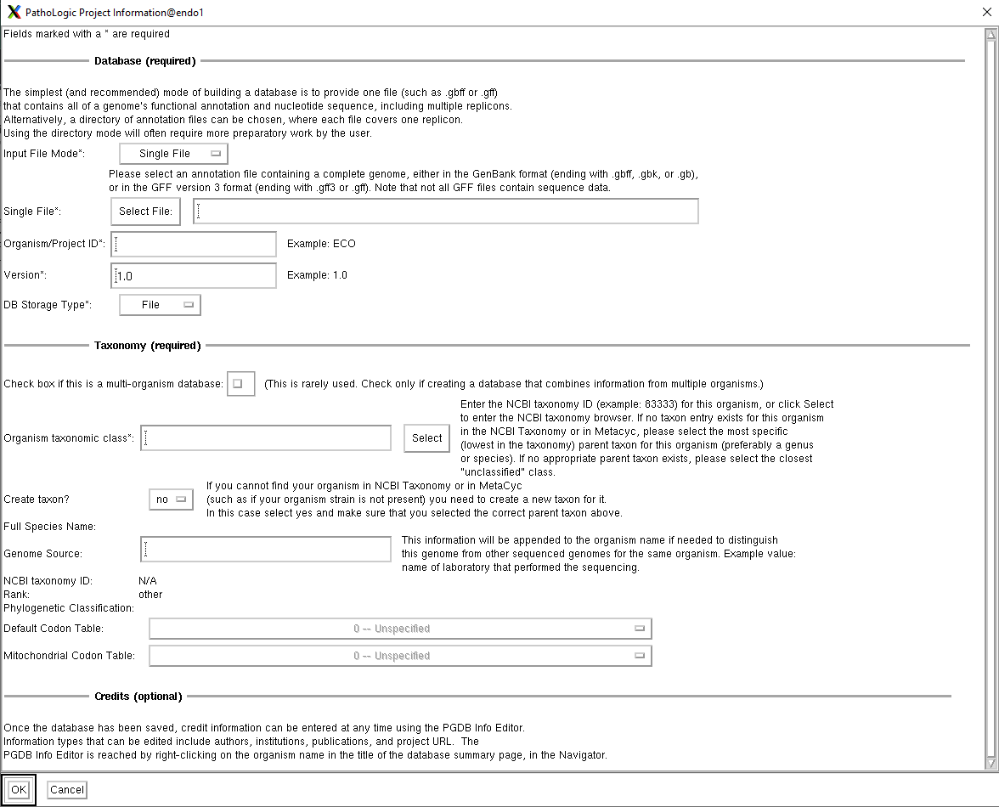
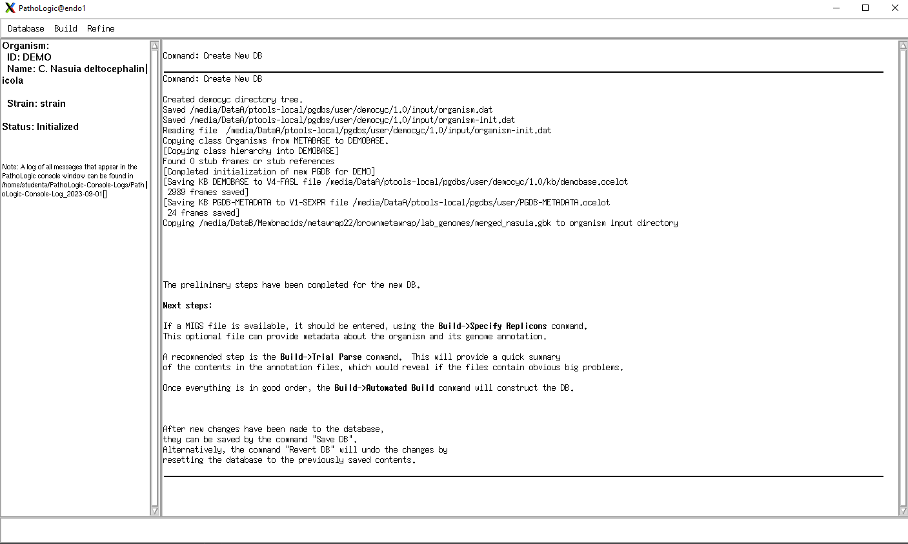
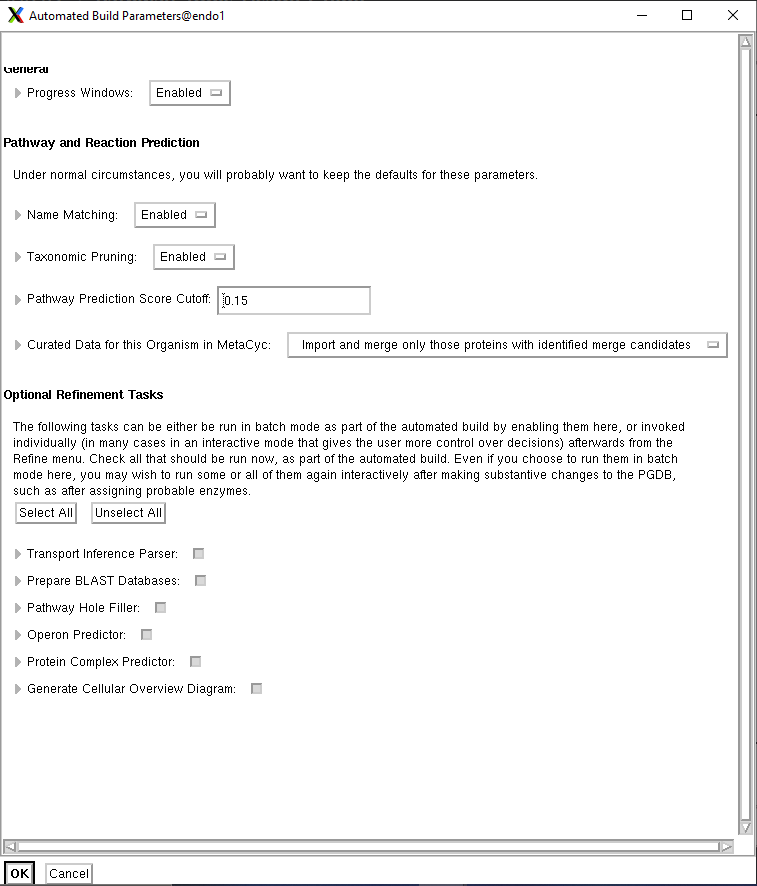
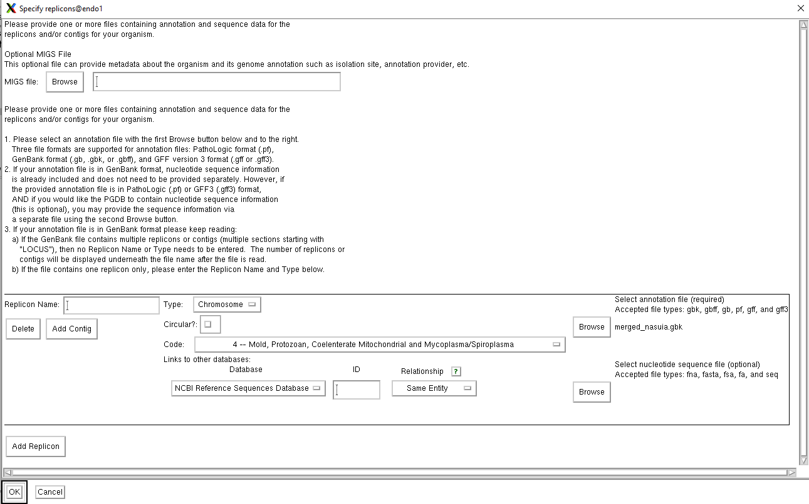

# Pathway Tools Usage Guide
## 0: Using remote GUI on endo1
When not directly acccessing the server on endo1, you will need to connect to the server in a way that supports GUI. On windows, I use MobaXTerm. To use MobaXterm, install the free version at https://mobaxterm.mobatek.net/download.html. Run the installer, and then open MobaXTerm. Once there, click "Session->SSH." Fill out the boxes - in "Remote Host," fill in endo1.ttu.edu, click specify username, and fill that out as studenta.

## I: PGDB (Pathway Genome Data) Creation using PathoLogic
Video tutorial: https://www.youtube.com/watch?v=CVnGFayWQ_Q
We use the PathoLogic tool to generate PGDBs for each of our species. To do this, PathoLogic needs an annotated genome in a .gbff, .gb, or .gff format. 

### I.1 Opening Pathway Tools and PathoLogic
To begin PathoLogic modelling, open the Pathway Tools window. 

    cd /media/DataA/pathway-tools
    ./pathway-tools
Pathway Tools updates fairly regularly. In the event that an update is required, the tool may not open unless the update is downloaded. You may receive an error message along the lines of 

    Operation not permitted [errno=1].
    [condition type: FILE-ERROR]
 In this case, you will need to activate Pathway Tools as a superuser. Once the update has run, you will be able to activate Pathway Tools normally again.

Once Pathway Tools is open successfully, go to Tools -> PathoLogic.

### I.2 Initialization of PGDB

Once PathoLogic is open, select the options to create a new PGDB by selecting Database -> Create New DB. This will open a window that will allow you to edit changes

PathoLogic requires a path to the annotated genome. The path will need to either be selected through the use of the GUI or typed in manually. I have not been able to directly copy-paste the path into Pathway Tools.

In addition an annotated genome, PathoLogic requires taxon data for the species. This can be provided either using the NCBI taxon number (unless using certain NCBI data, which already contains Taxon data)

When using PathoLogic on NCBI genome data, I used the .gbff format. This always has worked for me, although I have not tried any other data.

When using PathoLogic on prokka annotated genomes, I recommend using the .gbk or .gb files. These both seem to work well.[^1]

**IMPORTANT NOTE**: Pathway Tools will NOT work with contig level data. There are two possibilities when dealing with contig-level data:
1. Use the Specify Replicons editor (see part II.1 for more info) to manually specify each individual contig. I have not tested this, but I believe that you will need to have one contig per file.
2. Directly concatenate each of the annotated contigs. This method I have found to be the most successful. A python script for performing this task is located at

    /media/DataB/Membracids/metawrap22/brownmetawrap/lab_genomes/script.py

It uses the BioPython package, so I have set up a virtual environment in that directory as well. I didn't make the venv relocatable - if you want to move it then you might have to make a new venv and install BioPython.

To activate it, use the following command:

    python script.py [input].gbk [output].gbk

The .gbk extension can also be substituted for .gb or .gbff, etc.

When filling out "Organism/Project ID" the ID that you choose for the PGDB really does not matter - the interface displays the PGDBs that you have constructed based on the species name, rather than the PGDB ID. So, just pick an ID that hasn't already been picked.

Now, the PGDB is initialized. You will be able to see it and interact with it, although it will have no metabolic data.

### I.3 Generating metabolic data

To generate metabolic data, use Build->Automated Build. Change your parameters as you like - the Automated Build window already has fairly helpful descriptions of what each of them do.

Once it starts running, no user input is required. PathoLogic will automatically perform each of the steps to build a PGDB.

Occasionally, PathoLogic will freeze for some unknown reason. I still haven't figured out why this happens, but in this case you will need to follow the instructions in the terminal window to close out the PathoLogic window. Then, restart PathoLogic from the Pathway Tools Navigator window.

Occaisionally, PathoLogic will produce a non-fatal error, saying that something went wrong when constructing BLAST DBs. PathoLogic uses BLAST DBs for gap-filling, which, as the name suggests, fills in "gaps" or missing enzymes in metabolic pathways using algorithmic methods.[^2] This may be a sign of problems with the data, however, PathoLogic will continue running after you close the error window.

Once the automated build has completed (which can take anywhere from 15 minutes to 3-4 hours depending on genome size), you will be able to view the general statistics. Make sure to save the newly constructed PGDB.

## II: Constructing multi-chromosomal PGDBs

### II.1 Singular Organism PGDBs 
When working with certain large data (for example, insect genomes), Pathway Tools may crash due to not having enough free memory. In this case, the solution is to construct a multi-chromosomal PGDB.

To do this, put each of the chromosomes into a directory. Then, enter the PathoLogic window and specify that the organism's genomic data comes from a directory, rather than a single file. Complete the remaining steps for PGDB initialization. 

Once you have initialized the PGDB, do not run an Automated Build yet. First, enter the "Specify replicons" editor through Build->Specify Replicons. Here, you will need to specify the names of each of the replicons, their filepath, and the type of replicon (e.g. chromosomal, plasmid, etc.). 

The name "Replicons" is a bit of a misnomer - even though biologically there may be multiple replicons per file, you can use full chromosomes, as long as you have a file and a type. 

Note that the Specify Replicons editor can also be used to specify contigs, if each of the contigs are in a seperate file within a folder.

Once each of the replicons have been specified, you may run Automated Build as per section I.3.

### II.2 Multi-Organism PGDBs
An interesting proposal by Dr. Brown to simulate the free flow of nutrients between host and endosymbiont is to construct a "Multi-Organism PGDB." To do this, follow the same steps as with section II.1, however with each of the seperate genomes inside a directory instead of replicons. Select that you wish to create a multi-organism PGDB in the PathoLogic editor, and specify replicons as before. 

When editing replicons of a multi-organism PGDB, PathoLogic may freeze. I still have not determined the root cause of the issue. I would say to try and add taxon data and genome information (e.g. whether it is circular or not) directly into the .gbff file, but I have not personally tested this.

In addition, when running Automated Build, I recommend turning off Taxonomic pruning in the options. When running, Pathway Tools prunes pathways based on knowledge of the organism's taxonomy, however, when constructing a multi-organism PGDB this ends up pruning a lot of pathways that should not be pruned.

## III PGDB analysis

### III.1 General statistics
To view general statistics for PGDBs, simply click on them in the Pathway Tools navigator. Pathway Tools loads PGDB data lazily, so you have to click on the PGDB for its statistics to show up.

### III.2 Comparative Genome Dashboard
The main method of analyzing PGDBs that I have used is the Comparative Genome Dashboard. The comparative genome dashboard provides a nice interface that allows us to examine the presence of pathways across multiple organisms. To access it, go to Tools -> Comparative Genome Dashboard. After selecting which organisms you want to view, by using left click to add and right click to remove organisms, it will open up a window in Firefox that will allow you to examine the presence of pathways.

### III.3 Examining at individual pathways
For a more fine-grained view of individual pathways, you can also view the presence and completeness of pathways across different organisms. To do this, select the MetaCyc database. Then, click on "Pathway" to view the various methods of searching for individual pathways. Once that is open you can compare between different species.

From there, you will be able to view the completeness of individual pathways across all organisms. This will allow you to identify if certain pathways are complete or missing certain reactions in organisms. Note that due to pruning, certain pathways that have all the reactions present will be marked as not present in the organism.

## IV: Future Work
- Once McKinlee is able to successfully procure more assembled genomes from membracid endosymbionts, it would be helpful to try and construct PGDBs out of them. Currently, I have Wolbachia, Sulcia and Nasuia, but the other endosymbionts are all from NCBI.
- Dr. Brown has suggested the usage of MetaFlux for gene knockout. To do this, Pathway Tools requires the submission of a .fba file. Pathway Tools is capable of automatically generating a template for your organism. However, it doesn't work out of the box. When I ran MetaFlux, it errored, stating that "no nutrients or secretions provided." I took a crack at trying to use ModelSeed to fill in nutrients, which didn't work. I believe that it is because the data I used from ModelSeed was the biomasses, rather than nutrients which are not contained in ModelSeed data. I would also take a closer look at the file format for .fba files. I also found the following link https://bioinformatics.ai.sri.com/ptools/tutorial/sessions/flux-balance-analysis/ which is super helpful. In addition to containing MetaFlux tutorials, it contains template fbas. They seem to be for a previous version of Pathway Tools, as they also error when being used as input to MetaFlux. The error states that for most of the input compartment (the default cytosol compartment name is [CCO-CYTOSOL]) is not provided - I think the next step is to download one of these template files, fill in the compartment names for all of the biomasses, and try to run it.
- BioCyc Integration - Dr. Brown has suggested integrating some parts of the BioCyc database for metabolic network inference. I am not sure what that would look like, but it might prove helpful in fixing some of the reaction count issues that we had when working with eukaryotic organisms.

## V Additional Information
You can find the genomes I used in

    /media/DataB/Membracids/metawrap22/brownmetawrap/lab_genomes
    /media/DataB/Membracids/metawrap22/brownmetawrap/pathwaytools_ref_genomes
for McKinlee's genomes and NCBI genomes respectively.

In addition, the Pathway Tools paper (https://arxiv.org/abs/1510.03964v3) might have helpful information.

As mentioned before, there are lots of metaflux resources located here: https://bioinformatics.ai.sri.com/ptools/tutorial/sessions/flux-balance-analysis/

Finally, I have uploaded my research report to this repo. It might contain some helpful information.

[^1]: I have not been able to successfully use Pathway Tools with certain .gff files, as they sometimes do not contain sequence data. I suspect that you will need to use the "Enter Replicons" editor to specify a path to a fasta file.

[^2]: This is possibly the reason why the eukaryotic organisms that I have run had such low pathway count when compared to prokaryotes, as I encountered these errors when running insect and yeast genomes. However, I have not found a workaround for this, and I don't really know what is causing the problem.
